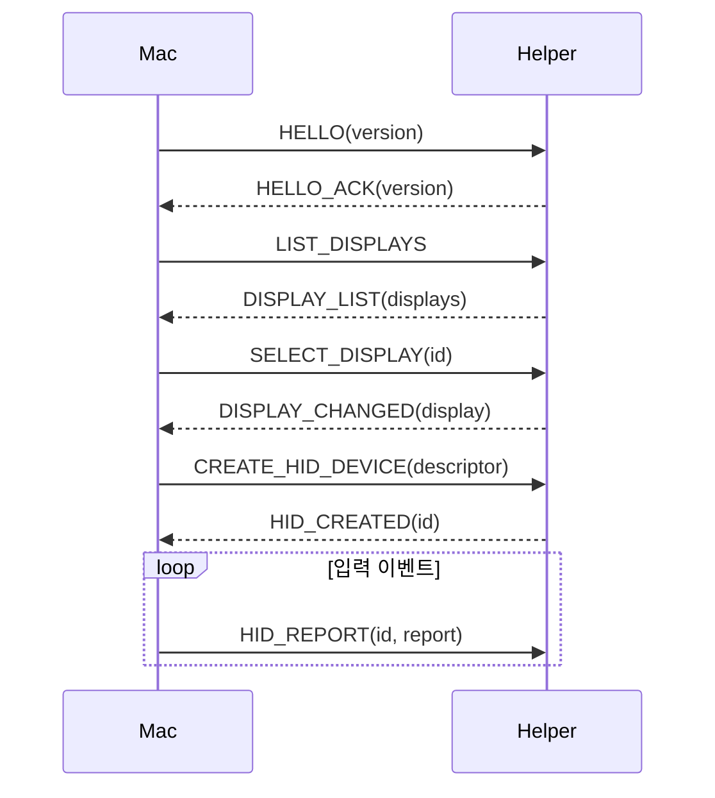

# CXI Protocol (v1)

macOS 앱 ↔ Android helper 사이의 바이너리 프로토콜.
transport: ADB subprocess stdin/stdout (app_process 실행).

> 규칙: 이 문서를 변경하면 `protocol/fixtures/`의 golden fixture와 양쪽 구현(Swift/Kotlin)을 함께 갱신해야 한다 (AGENTS.md 하드 룰 6).

## 프레임 형식

모든 메시지는 단일 프레임으로, 모든 정수는 **리틀엔디언**:

```
0                   1                   2                   3
0 1 2 3 4 5 6 7 8 9 0 1 2 3 4 5 6 7 8 9 0 1 2 3 4 5 6 7 8 9 0 1
+-+-+-+-+-+-+-+-+-+-+-+-+-+-+-+-+-+-+-+-+-+-+-+-+-+-+-+-+-+-+-+-+
|       magic "CXI" (3 bytes)                                  |
+-+-+-+-+-+-+-+-+-+-+-+-+-+-+-+-+-+-+-+-+-+-+-+-+-+-+-+-+-+-+-+-+
|      version (u16)     |     messageType (u16)   |
+-+-+-+-+-+-+-+-+-+-+-+-+-+-+-+-+-+-+-+-+-+-+-+-+-+-+
|                      requestId (u32)                         |
+-+-+-+-+-+-+-+-+-+-+-+-+-+-+-+-+-+-+-+-+-+-+-+-+-+-+-+-+-+-+-+-+
|                     payloadLen (u32)                          |
+-+-+-+-+-+-+-+-+-+-+-+-+-+-+-+-+-+-+-+-+-+-+-+-+-+-+-+-+-+-+-+-+
|                     payload (payloadLen bytes)                |
+-+-+-+-+-+-+-+-+-+-+-+-+-+-+-+-+-+-+-+-+-+-+-+-+-+-+-+-+-+-+-+-+
```

- magic: `43 58 49` ("CXI")
- version: `1`
- requestId: 요청-응답 매칭용. 응답은 동일한 requestId로 응답.

## 메시지 타입

### Mac → Android

| messageType | 이름 | payload |
|---|---|---|
| 0x0001 | HELLO | version u16 (프로토콜 버전) |
| 0x0002 | LIST_DISPLAYS | (없음) |
| 0x0003 | SELECT_DISPLAY | displayId u32 |
| 0x0004 | CREATE_HID_DEVICE | descriptor: u32 length + bytes |
| 0x0005 | DESTROY_HID_DEVICE | deviceId u32 |
| 0x0006 | HID_REPORT | deviceId u32 + report: u32 length + bytes |
| 0x0007 | PING | (없음) |
| 0x0008 | SHUTDOWN | (없음) |

### Android → Mac

| messageType | 이름 | payload |
|---|---|---|
| 0x8001 | HELLO_ACK | version u16 |
| 0x8002 | DISPLAY_LIST | count u32 + [display] |
| 0x8003 | DISPLAY_CHANGED | display (아래) |
| 0x8004 | HID_CREATED | deviceId u32 |
| 0x8005 | HID_ERROR | deviceId u32 + code u32 + message: u32 length + bytes |
| 0x8006 | PONG | (없음) |
| 0x8007 | LOG_EVENT | level u8 + tag: u32 length + bytes + message: u32 length + bytes |
| 0x8008 | FATAL_ERROR | code u32 + message: u32 length + bytes |

## display 구조

```
displayId u32
type u8          (0=UNKNOWN 1=BUILT_IN 2=HDMI 3=DP 4=VIRTUAL 5=EXTERNAL 6=OVERLAY 7=FLAG_DESKTOP)
flags u32        (raw Display.FLAG_*)
state u8         (0=OFF 1=ON 2=DOZE 3=DOZE_SUSPEND 4=ON_SUSPEND 5=UNKNOWN)
width u32        (자연 해상도)
height u32
densityDpi u32
rotation u8      (0/1/2/3)
name: u32 length + UTF-8 bytes
uniqueId: u32 length + UTF-8 bytes
layerStack u32   (있으면, -1이면 생략 의미 — v1에서는 항상 기록)
```

## 메시지 흐름 (최소 시나리오)

```
Mac ──────────────────────────► Android
HELLO (req 1)                    │
                                 ├─► HELLO_ACK (req 1)
LIST_DISPLAYS (req 2)            │
                                 ├─► DISPLAY_LIST (req 2)
SELECT_DISPLAY (req 3)           │
                                 ├─► DISPLAY_LIST 또는 DISPLAY_CHANGED (req 3)
CREATE_HID_DEVICE (req 4)        │
                                 ├─► HID_CREATED (req 4)
HID_REPORT (req 5..n)            │   (매 입력마다)
PING (req m)                     │
                                 ├─► PONG (req m)
SHUTDOWN (req z)                 │
                                 ├─► (프로세스 종료)
```

## 시퀀스 다이어그램 (mermaid)



## 버전 규칙

- v1: 초기 정의. 이후 변경은 필드 추가(하위 호환)는 버전 유지, 제거/의미 변경은 버전 증가.

## 참고: leap-scrcpy 프로토콜 (조사)

leap-scrcpy의 자체 프로토콜은 서로 다른 형태(version/displayInfo/clipboard/UHID 메시지, 빅엔디언). CXI은 이와 독립적으로 설계됨 — 문서화 목적으로만 기록:
- `VersionMessage { major s32, minor s32 }`, `DisplayInfoMessage { width s32, height s32, rotation s32 }`, `UHidMessage { id s32, data buffer(s32) }` — 리틀엔디언 아님(big endian으로 직렬화).
- 참고: leap-scrcpy는 UHID_CREATE2를 `/dev/uhid` 직접 open/write로 구현 (root 불필요, shell 권한).
