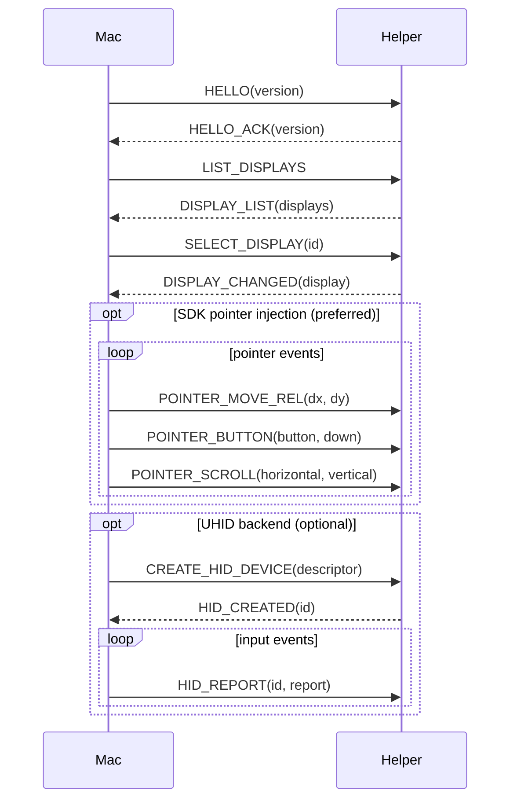

# CXI Protocol (v1)

Binary protocol between the macOS app and the Android helper.
Transport: ADB subprocess stdin/stdout (app_process execution).

> Rule: changing this document requires updating the golden fixtures in `protocol/fixtures/` and both implementations (Swift/Kotlin) (AGENTS.md hard rule 6).

## Frame format

Every message is a single frame; all integers are **little-endian**:

```
0                   1                   2                   3
0 1 2 3 4 5 6 7 8 9 0 1 2 3 4 5 6 7 8 9 0 1 2 3 4 5 6 7 8 9 0 1
+-+-+-+-+-+-+-+-+-+-+-+-+-+-+-+-+-+-+-+-+-+-+-+-+-+-+-+-+-+-+-+-+
|       magic "CXI" (3 bytes)                                  |
+-+-+-+-+-+-+-+-+-+-+-+-+-+-+-+-+-+-+-+-+-+-+-+-+-+-+-+-+-+-+-+-+
|      version (u16)     |     messageType (u16)   |
+-+-+-+-+-+-+-+-+-+-+-+-+-+-+-+-+-+-+-+-+-+-+-+-+-+-+
|                      requestId (u32)                         |
+-+-+-+-+-+-+-+-+-+-+-+-+-+-+-+-+-+-+-+-+-+-+-+-+-+-+-+-+-+-+-+-+
|                     payloadLen (u32)                          |
+-+-+-+-+-+-+-+-+-+-+-+-+-+-+-+-+-+-+-+-+-+-+-+-+-+-+-+-+-+-+-+-+
|                     payload (payloadLen bytes)                |
+-+-+-+-+-+-+-+-+-+-+-+-+-+-+-+-+-+-+-+-+-+-+-+-+-+-+-+-+-+-+-+-+
```

- magic: `43 58 49` ("CXI")
- version: `1`
- requestId: for request-response matching. Responses reply with the same requestId.

## Message types

### Mac → Android

| messageType | Name | payload |
|---|---|---|
| 0x0001 | HELLO | version u16 (protocol version) |
| 0x0002 | LIST_DISPLAYS | (none) |
| 0x0003 | SELECT_DISPLAY | displayId u32 |
| 0x0004 | CREATE_HID_DEVICE | descriptor: u32 length + bytes |
| 0x0005 | DESTROY_HID_DEVICE | deviceId u32 |
| 0x0006 | HID_REPORT | deviceId u32 + report: u32 length + bytes |
| 0x0007 | PING | (none) |
| 0x0008 | SHUTDOWN | (none) |
| 0x0009 | POINTER_MOVE_REL | dx i32 + dy i32 (relative pointer delta, target display pixels) |
| 0x000A | POINTER_BUTTON | button u32 + down u8 (button: 0=left 1=right 2=middle) |
| 0x000B | POINTER_SCROLL | horizontal f32 + vertical f32 (positive vertical = up, positive horizontal = left, Android AXIS_* convention) |
| 0x000C | KEY_EVENT | keyCode u16 + metaState u32 + action u8 + repeatCount u8 (Android KeyEvent semantics, see below) |

### Android → Mac

| messageType | Name | payload |
|---|---|---|
| 0x8001 | HELLO_ACK | version u16 |
| 0x8002 | DISPLAY_LIST | count u32 + [display] |
| 0x8003 | DISPLAY_CHANGED | display (below) |
| 0x8004 | HID_CREATED | deviceId u32 |
| 0x8005 | HID_ERROR | deviceId u32 + code u32 + message: u32 length + bytes |
| 0x8006 | PONG | (none) |
| 0x8007 | LOG_EVENT | level u8 + tag: u32 length + bytes + message: u32 length + bytes |
| 0x8008 | FATAL_ERROR | code u32 + message: u32 length + bytes |

## display structure

```
displayId u32
type u8          (0=UNKNOWN 1=BUILT_IN 2=HDMI 3=DP 4=VIRTUAL 5=EXTERNAL 6=OVERLAY 7=FLAG_DESKTOP)
flags u32        (raw Display.FLAG_*)
state u8         (AOSP Display.STATE_*: 0=UNKNOWN 1=OFF 2=ON 3=DOZE 4=DOZE_SUSPEND 5=VR 6=ON_SUSPEND)
width u32        (natural resolution)
height u32
densityDpi u32
rotation u8      (0/1/2/3)
name: u32 length + UTF-8 bytes
uniqueId: u32 length + UTF-8 bytes
layerStack u32   (always recorded in v1; -1 if unknown)
```

## KEY_EVENT semantics (ADR-0007)

`KEY_EVENT` is the single keyboard message covering both Android delivery backends
(UHID keyboard and virtual-keyboard injection). The Mac sends abstract key events;
**the helper decides the backend** and reports failures via `HID_ERROR`.

```
keyCode u16      Android KeyEvent.KEYCODE_* (e.g. 29=KEYCODE_A, 67=KEYCODE_DEL, 111=KEYCODE_ESCAPE)
metaState u32    Android KeyEvent.META_* bit flags (actual Android constants:
                 0x1=Shift, 0x2=Alt, 0x4=Sym, 0x8=Function, 0x1000=Ctrl, 0x10000=Meta,
                 plus LEFT/RIGHT-specific bits 0x40/0x80 Shift, 0x10/0x20 Alt, 0x2000/0x4000 Ctrl)
action u8        0=KEY_ACTION_DOWN, 1=KEY_ACTION_UP
repeatCount u8   repeat count (0 = first press; key repeats are sent as explicit DOWN events)
```

Backend selection rules:

1. **UHID keyboard backend** (preferred): the Mac creates the keyboard device with
   `CREATE_HID_DEVICE` using the standard boot keyboard descriptor (below), then
   sends `HID_REPORT` built from `KEY_EVENT`. Equivalently, the helper may keep an
   internal keyCode→HID-usage map and translate `KEY_EVENT` directly — both paths
   are valid; the descriptor-driven path keeps the Mac in control of the device.
2. **Virtual injection fallback**: if UHID keyboard creation or reporting fails
   (or is not available on the device), the helper injects `KeyEvent`s from
   `KEY_EVENT` directly (no keycode translation needed).
3. The helper must not silently drop keyboard input: if the selected display
   cannot receive it, reply `HID_ERROR` (deviceId 0) so the Mac can surface it.

### Standard boot keyboard HID descriptor (for CREATE_HID_DEVICE)

USB HID standard boot keyboard descriptor (as used by Linux uhid examples):

```
0x05 0x01  Usage Page (Generic Desktop)
0x09 0x06  Usage (Keyboard)
0xA1 0x01  Collection (Application)
0x05 0x07  Usage Page (Keyboard/Keypad)
0x19 0xE0  Usage Minimum (Keyboard Left Control)
0x29 0xE7  Usage Maximum (Keyboard Right GUI)
0x15 0x00  Logical Minimum (0)
0x25 0x01  Logical Maximum (1)
0x75 0x01  Report Size (1)
0x95 0x08  Report Count (8)
0x81 0x02  Input (Data, Var, Abs) — modifier byte
0x95 0x01  Report Count (1)
0x75 0x08  Report Size (8)
0x81 0x01  Input (Const) — reserved byte
0x95 0x05  Report Count (5)
0x75 0x01  Report Size (1)
0x05 0x08  Usage Page (LEDs)
0x19 0x01  Usage Minimum (1)
0x29 0x05  Usage Maximum (5)
0x91 0x02  Output (Data, Var, Abs) — LED report
0x95 0x01  Report Count (1)
0x75 0x03  Report Size (3)
0x91 0x01  Output (Const) — LED padding
0x95 0x06  Report Count (6)
0x75 0x08  Report Size (8)
0x15 0x00  Logical Minimum (0)
0x25 0x65  Logical Maximum (101)
0x05 0x07  Usage Page (Keyboard/Keypad)
0x19 0x00  Usage Minimum (0)
0x29 0x65  Usage Maximum (101)
0x81 0x00  Input (Data, Array) — key array (6 bytes)
0xC0      End Collection
```

Bytes: `05 01 09 06 A1 01 05 07 19 E0 29 E7 15 00 25 01 75 01 95 08 81 02 95 01 75 08 81 01 95 05 75 01 05 08 19 01 29 05 91 02 95 01 75 03 91 01 95 06 75 08 15 00 25 65 05 07 19 00 29 65 81 00 C0`

## Message flow (minimal scenario)

```
Mac ──────────────────────────► Android
HELLO (req 1)                    │
                                 ├─► HELLO_ACK (req 1)
LIST_DISPLAYS (req 2)            │
                                 ├─► DISPLAY_LIST (req 2)
SELECT_DISPLAY (req 3)           │   (routes subsequent POINTER_* to the
                                 │    selected display)
                                 ├─► DISPLAY_CHANGED (req 3)
CREATE_HID_DEVICE (req 4)        │   (optional UHID backend)
                                 ├─► HID_CREATED (req 4)
HID_REPORT (req 5..n)            │   (per input; UHID backend)
POINTER_MOVE_REL / BUTTON /      │   (SDK injection backend, preferred:
SCROLL (req n..m)                │    injectInputEvent with display ID)
PING (req m)                     │
                                 ├─► PONG (req m)
SHUTDOWN (req z)                 │
                                 ├─► (process exit)
```

## Sequence diagram (mermaid)



## Version rules

- v1: initial definition. Later changes: field additions (backward compatible) keep the version; removals/meaning changes bump the version.

## Reference: leap-scrcpy protocol (research)

leap-scrcpy's own protocol has a different shape (version/displayInfo/clipboard/UHID messages, big-endian). CXI is designed independently — recorded for documentation only:
- `VersionMessage { major s32, minor s32 }`, `DisplayInfoMessage { width s32, height s32, rotation s32 }`, `UHidMessage { id s32, data buffer(s32) }` — not little-endian (serialized big-endian).
- Note: leap-scrcpy implements UHID_CREATE2 with direct `/dev/uhid` open/write (no root needed, shell permission).
