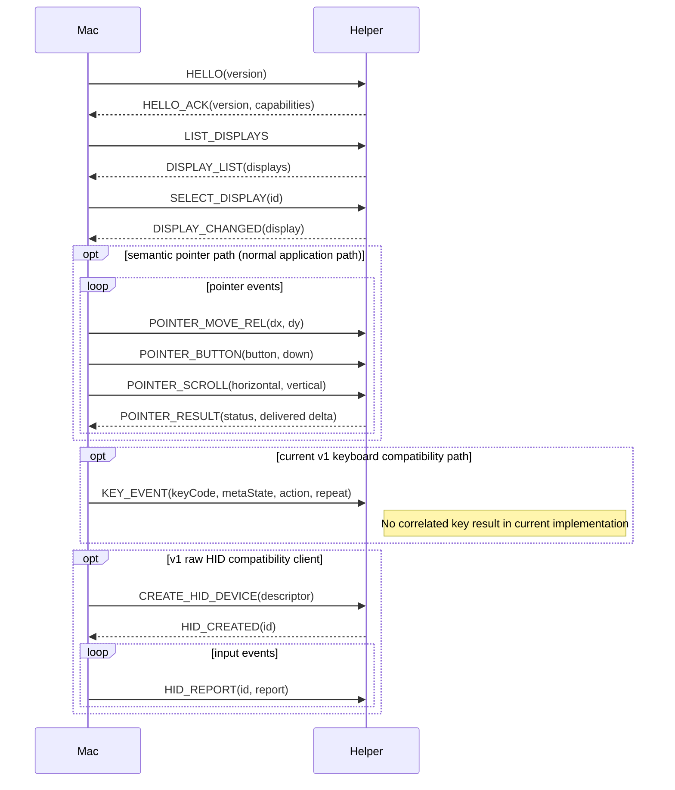

# CXI Protocol (v1)

Binary protocol between the macOS app and the Android helper.
Transport: ADB subprocess stdin/stdout (app_process execution).

> Rule: changing a production protocol message requires updating the golden
> fixtures in `protocol/fixtures/` and both implementations (Swift/Kotlin)
> (AGENTS.md hard rule 6).
>
> **Current-keyboard compatibility note (2026-09-13):** the implemented v1
> `KEY_EVENT` path is currently fire-and-forget at the protocol level: unlike
> semantic pointer requests, the helper sends no correlated key-delivery result.
> Helper/backend failure may therefore be observable only through metadata
> diagnostics while the Session remains alive. Architecture Leap ADR-0016 found
> that insufficient for persistent key-state ownership. Issue #141 owns an
> additive v1 capability/result extension (or equivalent reviewed mechanism)
> that must distinguish semantic certainty before the rebuilt delivery pipeline
> is complete. This note documents the **current wire**; it does not implement or
> reserve the final #141 encoding, and therefore changes no fixtures in this PR.

## Frame format

Every message is a single frame; all integers are **little-endian**:

```text
0                   1                   2                   3
0 1 2 3 4 5 6 7 8 9 0 1 2 3 4 5 6 7 8 9 0 1 2 3 4 5 6 7 8 9 0 1
+-+-+-+-+-+-+-+-+-+-+-+-+-+-+-+-+-+-+-+-+-+-+-+-+-+-+-+-+-+-+-+-+
|       magic "CXI" (3 bytes)                                  |
+-+-+-+-+-+-+-+-+-+-+-+-+-+-+-+-+-+-+-+-+-+-+-+-+-+-+-+-+-+-+-+-+
|      version (u16)     |     messageType (u16)   |
+-+-+-+-+-+-+-+-+-+-+-+-+-+-+-+-+-+-+-+-+-+-+-+-+-+-+
|                      requestId (u32)                         |
+-+-+-+-+-+-+-+-+-+-+-+-+-+-+-+-+-+-+-+-+-+-+-+-+-+-+-+-+-+-+-+-+
|                     payloadLen (u32)                          |
+-+-+-+-+-+-+-+-+-+-+-+-+-+-+-+-+-+-+-+-+-+-+-+-+-+-+-+-+-+-+-+-+
|                     payload (payloadLen bytes)                |
+-+-+-+-+-+-+-+-+-+-+-+-+-+-+-+-+-+-+-+-+-+-+-+-+-+-+-+-+-+-+-+-+
```

- magic: `43 58 49` ("CXI")
- version: `1`
- requestId: for request-response matching where a message defines a correlated
  response. A non-zero requestId on a message does not by itself guarantee that
  the current v1 message type has a semantic response (notably current
  `KEY_EVENT`).

## Message types

### Mac → Android

| messageType | Name | payload |
|---|---|---|
| 0x0001 | HELLO | version u16 (protocol version) |
| 0x0002 | LIST_DISPLAYS | (none) |
| 0x0003 | SELECT_DISPLAY | displayId u32 |
| 0x0004 | CREATE_HID_DEVICE | descriptor: u32 length + bytes |
| 0x0005 | DESTROY_HID_DEVICE | deviceId u32 |
| 0x0006 | HID_REPORT | deviceId u32 + report: u32 length + bytes |
| 0x0007 | PING | (none) |
| 0x0008 | SHUTDOWN | (none) |
| 0x0009 | POINTER_MOVE_REL | dx i32 + dy i32 (relative pointer delta, target display pixels) |
| 0x000A | POINTER_BUTTON | button u32 + down u8 (button: 0=left 1=right 2=middle) |
| 0x000B | POINTER_SCROLL | horizontal f32 + vertical f32 (positive vertical = up; positive horizontal = left — mirrors the macOS scroll axes; Android backends convert to their native conventions: AXIS_HSCROLL positive is right, so the InputManager backend negates horizontal and the UHID backend inverts it into the AC Pan field) |
| 0x000C | KEY_EVENT | keyCode u16 + metaState u32 + action u8 + repeatCount u8 (current v1 Android KeyEvent wire semantics; see below) |
| 0x000D | BOUNDARY_WATCH_START | controlToken u64 + displayId u32 + edge u8 |
| 0x000E | BOUNDARY_WATCH_STOP | controlToken u64 |

### Android → Mac

| messageType | Name | payload |
|---|---|---|
| 0x8001 | HELLO_ACK | version u16 + optional capabilities u32 |
| 0x8002 | DISPLAY_LIST | count u32 + [display] |
| 0x8003 | DISPLAY_CHANGED | display (below) |
| 0x8004 | HID_CREATED | deviceId u32 |
| 0x8005 | HID_ERROR | deviceId u32 + code u32 + message: u32 length + bytes |
| 0x8006 | PONG | (none) |
| 0x8007 | LOG_EVENT | level u8 + tag: u32 length + bytes + message: u32 length + bytes |
| 0x8008 | FATAL_ERROR | code u32 + message: u32 length + bytes |
| 0x8009 | POINTER_RESULT | status u8 + deliveredDx i32 + deliveredDy i32 |
| 0x800A | BOUNDARY_WATCH_READY | controlToken u64 + displayId u32 + mode u8 + layerStack i32 |
| 0x800B | BOUNDARY_REACHED | controlToken u64 + displayId u32 + edge u8 |
| 0x800C | BOUNDARY_WATCH_ERROR | controlToken u64 + code u8 |

There is currently **no correlated keyboard-result message** in the implemented
v1 table. #141 will define its additive capability/message semantics together
with fixtures and both implementations; ADR-0016 requires semantic outcome
classes equivalent to `applied`, proven `notApplied`, and `ambiguous`.

`POINTER_RESULT.status` is `0=DELIVERED`, `1=FAILED`, or
`2=PARTIALLY_DELIVERED`. The helper reports the movement actually accepted by
the selected backend. A partial UHID write is never retried; macOS accounts
only for `deliveredDx`/`deliveredDy` and returns control locally.

`HELLO_ACK` capability bits are additive within v1. A legacy two-byte ACK has
no advertised features and must be rejected by an application that requires
the current semantic pointer path. The current helper advertises:

| Bit | Name | Meaning |
|---:|---|---|
| 0 | `semanticPointerResult` | semantic pointer requests return `POINTER_RESULT` |
| 1 | `explicitPointerRouting` | the helper can serve pointer targets through an explicit-display-routing backend when required (desktop sinks may instead be served by the system-routed backend; see "Application path") |
| 2 | `boundaryWatch` | additive v1 boundary-watch preparation/events are implemented; system-routed UHID desktop targets may use the compositor oracle while explicit-display targets keep delivered-coordinate boundary accounting |

No keyboard semantic-result capability is implemented yet. #141 must allocate
and document any additive capability/result encoding before production use.

## Application path and v1 compatibility

The normal Ampersand application path uses the semantic `POINTER_*` messages
after `SELECT_DISPLAY`. The Android helper's `PointerDispatcher` owns backend
selection. For desktop sink targets (hidden `DisplayInfo.FLAG_DESKTOP`, e.g.
Samsung DeX), AUTO prefers the system-routed UHID mouse: its reports flow
through InputReader, so the visible pointer sprite follows the virtual
device — injected InputManager events bypass InputReader and never move it.
Every other target uses the InputManager backend, which sets the event
display ID explicitly. If the UHID device cannot be created or a report write
fails mid-session, the dispatcher currently degrades to InputManager until the
next `SELECT_DISPLAY`. macOS does not construct the semantic pointer descriptor
or report; that descriptor (buttons/X/Y/wheel/AC Pan) lives in the helper and is
covered by byte-exact unit tests.

`CREATE_HID_DEVICE`, `HID_REPORT`, and `DESTROY_HID_DEVICE` remain implemented
by the helper as a CXI v1 compatibility path for existing clients and fixtures.
They are not removed, renamed, or negotiated as CXI v2 in the Architecture Leap.

ADR-0016 adds ownership/ordering requirements around this existing wire. In
particular, target selection is a helper-global route barrier; old-Control
stateful work/cleanup must retire before a later route mutation. This does not
change the v1 frame encoding by itself.

## display structure

```text
displayId u32
type u8          (0=UNKNOWN 1=BUILT_IN 2=HDMI 3=DP 4=VIRTUAL 5=EXTERNAL 6=OVERLAY 7=FLAG_DESKTOP)
flags u32        (raw Display.FLAG_*)
state u8         (AOSP Display.STATE_*: 0=UNKNOWN 1=OFF 2=ON 3=DOZE 4=DOZE_SUSPEND 5=VR 6=ON_SUSPEND)
width u32        (natural resolution)
height u32
densityDpi u32
rotation u8      (0/1/2/3)
name: u32 length + UTF-8 bytes
uniqueId: u32 length + UTF-8 bytes
layerStack u32   (always recorded in v1; -1 if unknown)
```

## KEY_EVENT semantics (ADR-0007, current compatibility wire)

`KEY_EVENT` is the current CXI v1 keyboard wire message covering both Android
delivery backends (UHID keyboard and virtual-keyboard injection). The helper
decides the backend.

The current compatibility payload carries Android `KeyEvent` values:

```text
keyCode u16      Android KeyEvent.KEYCODE_* (e.g. 29=KEYCODE_A, 67=KEYCODE_DEL, 111=KEYCODE_ESCAPE)
metaState u32    Android KeyEvent.META_* bit flags (actual Android constants:
                 0x1=Shift, 0x2=Alt, 0x4=Sym, 0x8=Function, 0x1000=Ctrl, 0x10000=Meta,
                 plus LEFT/RIGHT-specific bits 0x40/0x80 Shift, 0x10/0x20 Alt, 0x2000/0x4000 Ctrl)
action u8        0=KEY_ACTION_DOWN, 1=KEY_ACTION_UP
repeatCount u8   repeat count (0 = first press; key repeats are sent as explicit DOWN events)
```

**Current outcome behavior:** `Controller.handle(TYPE_KEY_EVENT)` invokes the
keyboard backend and emits no correlated protocol response for that frame.
Backend selection/failure diagnostics may be logged as metadata, but a write to
the CXI stream is not semantic proof that the key transition was applied.
`HID_ERROR` belongs to the raw HID-device compatibility operations and must not
be documented as the normal semantic `KEY_EVENT` acknowledgement.

Backend selection rules:

1. **UHID keyboard backend** (preferred): the helper creates the keyboard device
   with the standard boot keyboard descriptor (below), maps `KEY_EVENT` to
   reports internally, and owns device cleanup. The application remains on the
   `KEY_EVENT` path at the v1 adapter boundary.
2. **Virtual injection fallback**: if UHID keyboard creation or reporting fails
   (or is not available on the device), the helper can inject Android
   `KeyEvent`s through the internal InputManager path.
3. Current helper teardown attempts to release owned keyboard state. That is
   useful defense in depth, but ADR-0016/#107 require backend-specific cleanup
   proof and #141 requires a normal per-transition semantic outcome; teardown
   alone is not final delivery acknowledgement.
4. Under Architecture Leap #103, Android `KEYCODE_*` / `META_*` values remain a
   compatibility-wire/remote-adapter concern rather than a platform-neutral
   host/domain API.

### Standard boot keyboard HID descriptor (for CREATE_HID_DEVICE)

USB HID standard boot keyboard descriptor (as used by Linux uhid examples):

```text
0x05 0x01  Usage Page (Generic Desktop)
0x09 0x06  Usage (Keyboard)
0xA1 0x01  Collection (Application)
0x05 0x07  Usage Page (Keyboard/Keypad)
0x19 0xE0  Usage Minimum (Keyboard Left Control)
0x29 0xE7  Usage Maximum (Keyboard Right GUI)
0x15 0x00  Logical Minimum (0)
0x25 0x01  Logical Maximum (1)
0x75 0x01  Report Size (1)
0x95 0x08  Report Count (8)
0x81 0x02  Input (Data, Var, Abs) — modifier byte
0x95 0x01  Report Count (1)
0x75 0x08  Report Size (8)
0x81 0x01  Input (Const) — reserved byte
0x95 0x05  Report Count (5)
0x75 0x01  Report Size (1)
0x05 0x08  Usage Page (LEDs)
0x19 0x01  Usage Minimum (1)
0x29 0x05  Usage Maximum (5)
0x91 0x02  Output (Data, Var, Abs) — LED report
0x95 0x01  Report Count (1)
0x75 0x03  Report Size (3)
0x91 0x01  Output (Const) — LED padding
0x95 0x06  Report Count (6)
0x75 0x08  Report Size (8)
0x15 0x00  Logical Minimum (0)
0x25 0x65  Logical Maximum (101)
0x05 0x07  Usage Page (Keyboard/Keypad)
0x19 0x00  Usage Minimum (0)
0x29 0x65  Usage Maximum (101)
0x81 0x00  Input (Data, Array) — key array (6 bytes)
0xC0      End Collection
```

Bytes: `05 01 09 06 A1 01 05 07 19 E0 29 E7 15 00 25 01 75 01 95 08 81 02 95 01 75 08 81 01 95 05 75 01 05 08 19 01 29 05 91 02 95 01 75 03 91 01 95 06 75 08 15 00 25 65 05 07 19 00 29 65 81 00 C0`

## Message flow (minimal scenario)

```text
Mac ──────────────────────────► Android
HELLO (req 1)                    │
                                 ├─► HELLO_ACK (req 1)
LIST_DISPLAYS (req 2)            │
                                 ├─► DISPLAY_LIST (req 2)
SELECT_DISPLAY (req 3)           │   (routes subsequent semantic POINTER_*
                                 │    messages through selected route state)
                                 ├─► DISPLAY_CHANGED (req 3)
POINTER_MOVE_REL / BUTTON /      │   (helper picks backend per target)
SCROLL (req 4..n)                │
                                 ├─► POINTER_RESULT (same req; semantic pointer result)
KEY_EVENT (req k)                │   (current v1 compatibility behavior)
                                 │    no correlated key-result frame today
PING (req m)                     │
                                 ├─► PONG (req m)
SHUTDOWN (req z)                 │
                                 ├─► (process exit)
```

Legacy clients may instead send `CREATE_HID_DEVICE` followed by `HID_REPORT`;
those frames remain supported without changing the v1 version number.

## Sequence diagram (mermaid)



## Version rules

- v1: initial definition. Later field/message/capability additions that are
  explicitly additive may keep the version; removals or incompatible meaning
  changes bump the version. Wire compatibility and runtime feature compatibility
  are separate: an older helper may speak v1 framing but still lack features
  required by the current application.
- #141 is intended as an additive v1 safety extension. Its exact capability,
  message type(s), result encoding, fixtures, and compatibility behavior are not
  defined by ADR-0016; they must be defined and reviewed together in #141 before
  implementation is considered complete.

## Reference: leap-scrcpy protocol (research)

leap-scrcpy's own protocol has a different shape (version/displayInfo/clipboard/UHID messages, big-endian). CXI is designed independently — recorded for documentation only:
- `VersionMessage { major s32, minor s32 }`, `DisplayInfoMessage { width s32, height s32, rotation s32 }`, `UHidMessage { id s32, data buffer(s32) }` — not little-endian (serialized big-endian).
- Note: leap-scrcpy implements UHID_CREATE2 with direct `/dev/uhid` open/write (no root needed, shell permission).

## Boundary-watch extension (issue #145)

The boundary-watch extension removes macOS-side screen-distance guessing from the
system-routed UHID desktop return path.

`BOUNDARY_WATCH_START` is a correlated request sent while host control is still
local/edge-armed. `edge` names the **remote display edge** that returns toward
macOS: `0=LEFT, 1=RIGHT, 2=TOP, 3=BOTTOM`.

The helper validates that `displayId` is still the selected target and replies
with either:

- `BOUNDARY_WATCH_READY` using the same requestId; or
- `BOUNDARY_WATCH_ERROR` using the same requestId.

`BOUNDARY_WATCH_READY.mode` is:

- `0=DELIVERED_COORDINATES`: the active backend has authoritative explicit
  screen-space accounting. macOS may keep the legacy delivered-coordinate
  handoff policy.
- `1=COMPOSITOR`: the active backend is system-routed UHID and the helper has
  validated a target-layer SurfaceFlinger Sprite oracle. macOS must not use
  relative-HID distance as screen-space authority.

For compositor mode the helper observes the selected target layer asynchronously.
It emits `BOUNDARY_REACHED` with requestId 0 only after sustained
return-direction input is followed by a distinguishable compositor clamp.
Direction reversal invalidates the current internal sampling generation, so an
in-flight sample from the superseded return-intent window cannot confirm.
macOS additionally accepts a confirmation only while current return-direction
intent remains active.
`BOUNDARY_WATCH_ERROR` with requestId 0 reports runtime loss of that safety
capability. Error codes are `1=TARGET_MISMATCH, 2=ORACLE_UNAVAILABLE,
3=BACKEND_CHANGED, 4=OBSERVATION_FAILED`.

`controlToken` is host-generated and unique per Control epoch. macOS accepts an
unsolicited boundary event only when the token, live Session, selected target,
and current Control still match. A stale event is ignored.

`BOUNDARY_WATCH_STOP` is fire-and-forget cleanup. Local host return never waits
for it. The helper must also invalidate old watches on target/backend/session changes.
For the selected display, add/change/remove callbacks invalidate both an active
watch and any preflight generation that has not yet produced READY. Backend
authority is revalidated after every semantic pointer class, not only movement,
so UHID -> InputManager failover cannot leave a compositor watch authoritative.

The acquisition rule is fail-closed:

```
localActive -> edgeArmed
  -> BOUNDARY_WATCH_START
  -> BOUNDARY_WATCH_READY
  -> revalidate same Session / Target / Control token
  -> remoteActive + suppression
```

A failed/stale preparation remains local; suppression is never installed first.
