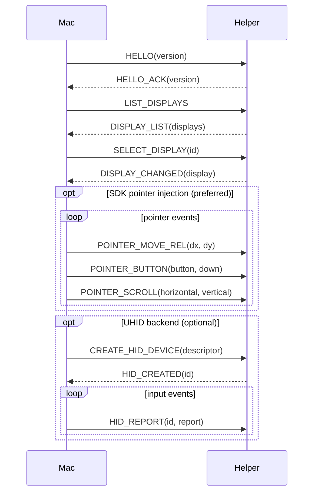

# CXI Protocol (v1)

Binary protocol between the macOS app and the Android helper.
Transport: ADB subprocess stdin/stdout (app_process execution).

> Rule: changing this document requires updating the golden fixtures in `protocol/fixtures/` and both implementations (Swift/Kotlin) (AGENTS.md hard rule 6).

## Frame format

Every message is a single frame; all integers are **little-endian**:

```
0                   1                   2                   3
0 1 2 3 4 5 6 7 8 9 0 1 2 3 4 5 6 7 8 9 0 1 2 3 4 5 6 7 8 9 0 1
+-+-+-+-+-+-+-+-+-+-+-+-+-+-+-+-+-+-+-+-+-+-+-+-+-+-+-+-+-+-+-+-+
|       magic "CXI" (3 bytes)                                  |
+-+-+-+-+-+-+-+-+-+-+-+-+-+-+-+-+-+-+-+-+-+-+-+-+-+-+-+-+-+-+-+-+
|      version (u16)     |     messageType (u16)   |
+-+-+-+-+-+-+-+-+-+-+-+-+-+-+-+-+-+-+-+-+-+-+-+-+-+-+
|                      requestId (u32)                         |
+-+-+-+-+-+-+-+-+-+-+-+-+-+-+-+-+-+-+-+-+-+-+-+-+-+-+-+-+-+-+-+-+
|                     payloadLen (u32)                          |
+-+-+-+-+-+-+-+-+-+-+-+-+-+-+-+-+-+-+-+-+-+-+-+-+-+-+-+-+-+-+-+-+
|                     payload (payloadLen bytes)                |
+-+-+-+-+-+-+-+-+-+-+-+-+-+-+-+-+-+-+-+-+-+-+-+-+-+-+-+-+-+-+-+-+
```

- magic: `43 58 49` ("CXI")
- version: `1`
- requestId: for request-response matching. Responses reply with the same requestId.

## Message types

### Mac → Android

| messageType | Name | payload |
|---|---|---|
| 0x0001 | HELLO | version u16 (protocol version) |
| 0x0002 | LIST_DISPLAYS | (none) |
| 0x0003 | SELECT_DISPLAY | displayId u32 |
| 0x0004 | CREATE_HID_DEVICE | descriptor: u32 length + bytes |
| 0x0005 | DESTROY_HID_DEVICE | deviceId u32 |
| 0x0006 | HID_REPORT | deviceId u32 + report: u32 length + bytes |
| 0x0007 | PING | (none) |
| 0x0008 | SHUTDOWN | (none) |
| 0x0009 | POINTER_MOVE_REL | dx i32 + dy i32 (relative pointer delta, target display pixels) |
| 0x000A | POINTER_BUTTON | button u32 + down u8 (button: 0=left 1=right 2=middle) |
| 0x000B | POINTER_SCROLL | horizontal f32 + vertical f32 (positive vertical = up, positive horizontal = left, Android AXIS_* convention) |

### Android → Mac

| messageType | Name | payload |
|---|---|---|
| 0x8001 | HELLO_ACK | version u16 |
| 0x8002 | DISPLAY_LIST | count u32 + [display] |
| 0x8003 | DISPLAY_CHANGED | display (below) |
| 0x8004 | HID_CREATED | deviceId u32 |
| 0x8005 | HID_ERROR | deviceId u32 + code u32 + message: u32 length + bytes |
| 0x8006 | PONG | (none) |
| 0x8007 | LOG_EVENT | level u8 + tag: u32 length + bytes + message: u32 length + bytes |
| 0x8008 | FATAL_ERROR | code u32 + message: u32 length + bytes |

## display structure

```
displayId u32
type u8          (0=UNKNOWN 1=BUILT_IN 2=HDMI 3=DP 4=VIRTUAL 5=EXTERNAL 6=OVERLAY 7=FLAG_DESKTOP)
flags u32        (raw Display.FLAG_*)
state u8         (AOSP Display.STATE_*: 0=UNKNOWN 1=OFF 2=ON 3=DOZE 4=DOZE_SUSPEND 5=VR 6=ON_SUSPEND)
width u32        (natural resolution)
height u32
densityDpi u32
rotation u8      (0/1/2/3)
name: u32 length + UTF-8 bytes
uniqueId: u32 length + UTF-8 bytes
layerStack u32   (always recorded in v1; -1 if unknown)
```

## Message flow (minimal scenario)

```
Mac ──────────────────────────► Android
HELLO (req 1)                    │
                                 ├─► HELLO_ACK (req 1)
LIST_DISPLAYS (req 2)            │
                                 ├─► DISPLAY_LIST (req 2)
SELECT_DISPLAY (req 3)           │   (routes subsequent POINTER_* to the
                                 │    selected display)
                                 ├─► DISPLAY_CHANGED (req 3)
CREATE_HID_DEVICE (req 4)        │   (optional UHID backend)
                                 ├─► HID_CREATED (req 4)
HID_REPORT (req 5..n)            │   (per input; UHID backend)
POINTER_MOVE_REL / BUTTON /      │   (SDK injection backend, preferred:
SCROLL (req n..m)                │    injectInputEvent with display ID)
PING (req m)                     │
                                 ├─► PONG (req m)
SHUTDOWN (req z)                 │
                                 ├─► (process exit)
```

## Sequence diagram (mermaid)



## Version rules

- v1: initial definition. Later changes: field additions (backward compatible) keep the version; removals/meaning changes bump the version.

## Reference: leap-scrcpy protocol (research)

leap-scrcpy's own protocol has a different shape (version/displayInfo/clipboard/UHID messages, big-endian). CXI is designed independently — recorded for documentation only:
- `VersionMessage { major s32, minor s32 }`, `DisplayInfoMessage { width s32, height s32, rotation s32 }`, `UHidMessage { id s32, data buffer(s32) }` — not little-endian (serialized big-endian).
- Note: leap-scrcpy implements UHID_CREATE2 with direct `/dev/uhid` open/write (no root needed, shell permission).
